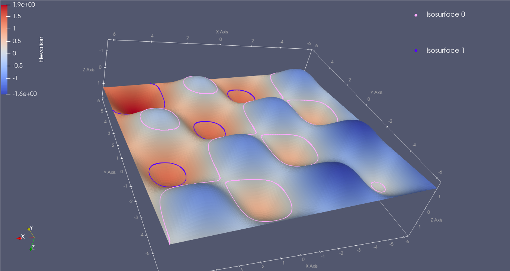
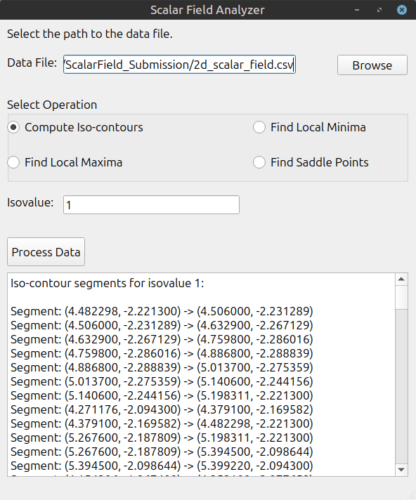
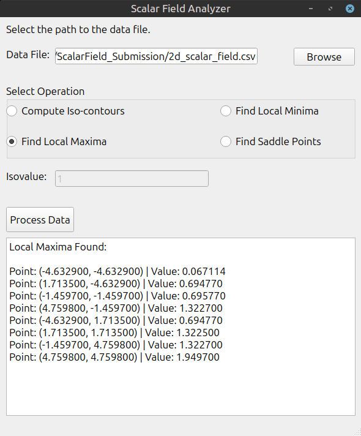

# 2D Scalar Field Analyzer


**Author:** Jaime Salvador López Viveros

## 1. Project Description

This is a graphical user interface (GUI) application built with **C++** and the **Qt 5** framework. It serves as a tool to analyze a 2D scalar function sampled on a 100x100 grid, provided in a `.csv` file.

The application combines two main functionalities:

1.  **Iso-contour Extraction:** Computes and lists the line segments that form the iso-contours for a specified isovalue, using the **Marching Squares** algorithm.
2.  **Critical Point Detection:** Analyzes the dataset to find and list all local minima, local maxima, and saddle points.

## 2. About the Data

The application processes a 2D scalar field sampled on a 100x100 grid (`2d_scalar_field.csv`).
To better understand the topology of the function being analyzed, here is a **3D visualization generated with ParaView** of the input dataset.


*Figure 1: 3D Surface visualization of the input scalar field (Ground Truth). The C++ application analyzes slices (iso-contours) and critical points of this structure.*

### Screenshots

| Iso-contour Extraction | Critical Point Detection |
|:---:|:---:|
|  |  |

---

## 3. Getting Started

These instructions will get you a copy of the project up and running on your local machine for development and testing purposes.

### Prerequisites

* **C++ Compiler** (GCC/Clang)
* **Qt 5 Development Libraries**
* **CMake** (or Qt Creator)

### Installation & Build

Since this repository contains the source code, you need to compile it first.

#### Option A: Using Command Line (Linux/macOS)

1.  Clone the repository:
    ```bash
    git clone [https://github.com/YOUR_USERNAME/ScalarFieldAnalyzer-Cpp.git](https://github.com/YOUR_USERNAME/ScalarFieldAnalyzer-Cpp.git)
    cd ScalarFieldAnalyzer-Cpp
    ```

2.  Create a build directory and run CMake:
    ```bash
    mkdir build
    cd build
    cmake ..
    make
    ```

3.  Run the application:
    ```bash
    ./ScalarFieldAnalyzer
    ```

#### Option B: Using Qt Creator

1.  Open **Qt Creator**.
2.  Go to **File** -> **Open File or Project...**
3.  Select the `CMakeLists.txt` file from this repository.
4.  Configure the project using your installed Qt kit.
5.  Click the **Run** button (green play icon).

---

## 4. Usage

1.  Launch the application.
2.  Click the **"Browse..."** button to select the provided sample file: `2d_scalar_field.csv` (located in the root of the repository).
3.  Select the desired operation:
    * **Iso-contour:** Enter a numeric isovalue (e.g., `0`, `1`, or `2`).
    * **Critical Points:** Just select the option.
4.  Click the **"Process Data"** button.
5.  The results (line segments or point coordinates) will be displayed in the text area at the bottom.

---

## License

This project is open source and available under the [MIT License](LICENSE).
